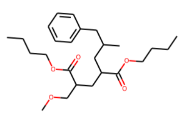
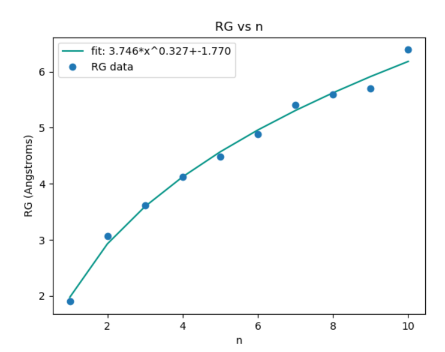
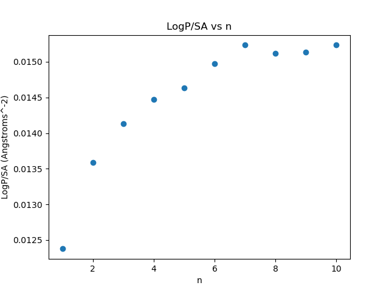
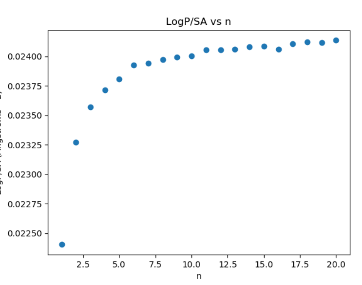
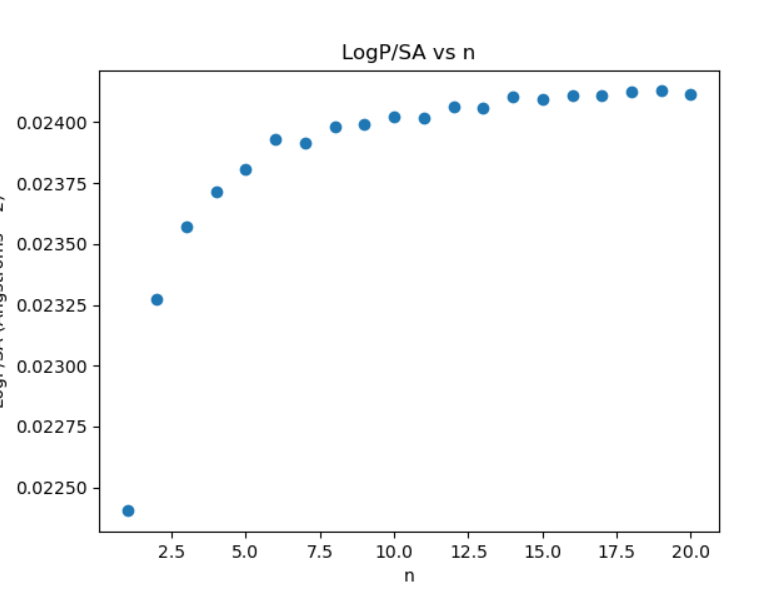
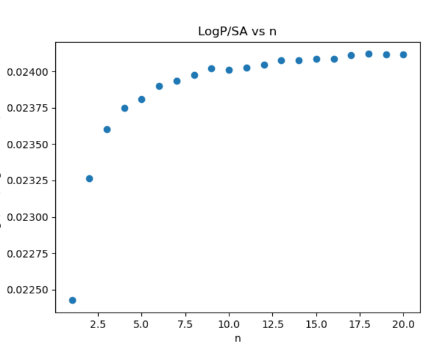
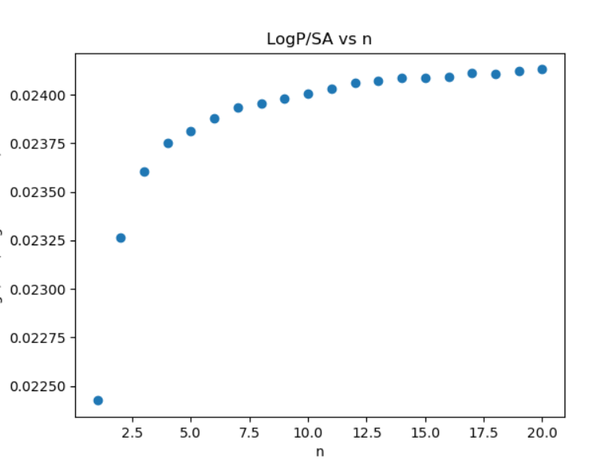

# Polymer Calculation Suite

This project enables users to perform several calulations on a limitless scope of polymers as long as the primary structure is known.

The command-line tool `makePol` has a wide range of command-line options that allow fine control over polymer specification and output format. These can be obtained by running `makePol -h`. A large, but non-comprehensive list of examples will be covered in the next section. The utility is also available through a jupyter notebook. An example can be generated with the command `HXNB`.

See [here](#installation) for installation instructions.

## Usage and Examples

Note that the following examples all use the `-q` flag. This suppresses the default behavior, which asks the user for confirmation that the polymer they have specified has been interpreted correctly. For example:



Is the confirmation image that would appear when [this example](#specifying-multiple-comonomers) is run without the `-q` flag.

This confirmation process may be more important when using smiles inputs that do not come stock with this program for the first time. Addtional details about adding your own smiles to the included dictionaries can be found [here](#modifying-the-smiles-dictionary). This is the default behavior to protect users from optimizing the geometry for incorrect polymers, which can be a time-consuming process for large values of `n`, but this can be dissabled for use in scripting or batch jobs.

Regardless of the provided value of `n`, the preview will only show one monomer or [block of comonomers](#specifying-multiple-comonomers) for simplicity.

This prompt will not be shown if both end groups are Hydrogen.

### Specifying Polymer Components

There are dictionaries of monomers and terminal units in `smiles.py` The composition of a polymer containing units in these dictionaries can be spelled out in the following manner. The `-v` flag increases verbosity.

```bash
$ makePol -n 3 -m Styrene -v
 Generating SMILES: ━━━━━━━━━━━━━━━━━━━━━━━━━━━━━━━━━━━━━━━━ 100% 0:00:00
 Optimizing Conformers: ━━━━━━━━━━━━━━━━━━━━━━━━━━━━━━━━━━━━━━━━ 100% 0:00:00
Saved polymer image to polymer.png
requested calculations are None
```
Because verbosity was enabled an image of the polymer was saved with a default name. The name of the image can be specified with the `-d` flag.
The initiator and terminal groups default to Hydrogen if none are specified.

## Specifying Multiple Comonomers
Here is another example with a more complex set of arguments:
```bash
$ makePol -n 2 -b 2 Butylacrylate "CC(C)" -i Benzoyl -t Benzyl -vq
 Generating SMILES: ━━━━━━━━━━━━━━━━━━━━━━━━━━━━━━━━━━━━━━━━ 100% 0:00:00
 Optimizing Conformers: ━━━━━━━━━━━━━━━━━━━━━━━━━━━━━━━━━━━━━━━━ 100% 0:00:01
Saved polymer image to polymer.png
requested calculations are None
```
The `-b` flag defines a sequence of comonomers in a specific repeating pattern. Comonomers can be specified using the monomer dictionary or with a SMILES string in quotation marks (i.e. "CC(C)"). When a coefficient is provided in the list of arguments defined by the `-b` flag, this changes the number of monomers per unit defined by the `-n` flag. In the above example, each unit of n refers to 3 monomers. The `-i` and `-t` flags are used to define initiators and terminators from either the dictionary or from SMILES. The number of monomers per n will be used for plots and image labels.

## Performing Calculations

The `-c` flag is followed by abbreviations for calulations that are desired. Availible options are:

LogP, SA (surface area), MV (Molecular Volume), MHP (LogP/SA; each of which will also be reported. Use XMHP to exclude those constituent calculations) and RG (radius of gyration).

When RG is selected, an exponential regression is performed. Polymer RG scales by n^(1/3) with the MMFF94 force field. This gives a sense of how reasonable the optimization steps were.

A run with Styrene to n=10 had the following regression:



#### Modifying The SMILES Dictionary

Use the command line tool `HXLib -w` to generate `smiles.json` which can be filled with custom key-value pairs. Examples that are ignored will be included, but the format of the SMILES should be as follows: 
   * The tail of the monomer at the left of the SMILES string and the head at the right. For example, propylene would be written `CC(C)`. This allows easy construction of the polymer body by simply repeating this string `n` times.

   * For non-palindromic end groups the atom to which the rest of the polymer should attatch must be denoted with `*`. The use of `*` is inspired by polymergenome.org. Additionally, the SMILES must be written such that the `*` is the first or last character in the string.

The use of the `-e` or `-m` flag with `HXLib` will show all the endgroups or monomers recognizable to the program, including those user-specified ones in `smiles.json`.

### Reading a Polymer From A File

You will notice with the second example the run time is noticable since there are several conformations being compared to make the final mol object in rdkit. Additionally, this process is not perfectly reproducible. If desired, one can load a premade `.sdf`, `.mol` or `.pdb` file instead of spelling out the polymer with the `-m` or `-b` flag. Polymers spelled out with the previously demonstrated methods can be converted to files as well with the `-s` flag. See the following section for details.

```bash
$ makePol -n 5 -r pol.mol -c SA RG LogP
           SA    LogP        RG  N                                                smi
0  370.961866  8.7707  4.076059  5  C[C@H](C[C@H](C[C@H](CCc1ccccc1)c1ccccc1)c1ccc...
```
Note that `-n` is required since the smiles is not analyzed to determine the number of monomers.

## Alternative Input Methods

### Custom Input
If the methods contained within this program are inadequate for the type of molecule desired, the accessory command line tool `customPol` may be useful. It can read Smiles, Smarts or Inchi strings and produce a `.mol` file that can be read for calculations with the master script.

Use the following to show instructions for this script:\
`customPol -h`

### Random Composition
The accessory script `-a` option of `makePol` can be used to interpret a ratio of monomers and develop a polymer that satisfy the user's desired monomer ratio. The monomers will be in a random order. Use the `-b` flag to specify the ratio of the comonomers.

For example, the command `makePol -n 20 -b 2 Styrene Vinylalcohol -a -c MV` will generate a randomly ordered 20 unit-long polymer with a 2:1 ratio of Styrene to Vinylalcohol (rounded if necessry, but the actual ratios used will be shown).

### Saving Polymer to File

The name or path of the file can be specified with the `-s` flag. Valid extentions are `.mol`, `.pdb` and `.xyz`. Be aware that `.xyz` files cannot be read back into this program.

```bash
$ makePol -n 4 -m Styrene -c MHP -v -s pol.mol
 Generating SMILES: ━━━━━━━━━━━━━━━━━━━━━━━━━━━━━━━━━━━━━━━━ 100% 0:00:00
 Optimizing Conformers: ━━━━━━━━━━━━━━━━━━━━━━━━━━━━━━━━━━━━━━━━ 100% 0:00:00
writing molecule to pol.mol
Success writing molecule to pol.mol
Saved polymer image to polymer.png
requested calculations are ['MHP']
           SA    LogP   LogP/SA  N                                               smi
0  607.669952  8.7707  0.014433  4  CC(c1ccccc1)CC(c1ccccc1)CC(c1ccccc1)CC(c1ccccc1)
```
In the next plotting section it is shown that many polymers of different lengths can be generated with the `-p` flag. When the `-s` flag is specified as well, each of those molecules will be saved to its own file with a name based off the one specified as a CLI argument. The number of repeat units will be used as a suffix.

## Plotting Size-Dependent Calculations

The size-dependent plots of any calculations performed can be generated with the `-p` flag. The sizes plotted will range from 1 repeat unit to the number specified by the `-n` flag. Because the repeat unit needs to be well-defined, this plotting option is unavailable if the polymer is being read from a file. Since the `-v` flag is used, a grid image of all the generated molecules will be created as well.

The data can be exported to a `.csv` file with the `-e` flag. 

```bash
#XMHP requests that the MHP data be eXclusively returned instead of including the LogP and SA values as well.
$ makePol -n 2 -m Styrene -c XMHP -e data.csv -vp
 Generating SMILES: ━━━━━━━━━━━━━━━━━━━━━━━━━━━━━━━━━━━━━━━━ 100% 0:00:00
 Optimizing Conformers: ━━━━━━━━━━━━━━━━━━━━━━━━━━━━━━━━━━━━━━━━ 100% 0:00:00
Saved polymer image to polymer.png
requested calculations are ['XMHP']
Saved plot to Size-dependent-stats.png
    LogP/SA  N                       smi
0  0.012379  1              CC(c1ccccc1)
1  0.013659  2  CC(c1ccccc1)CC(c1ccccc1)
#popup of plot appears.
Done exporting data to .csv file.
```
Nearly all of this output, including the plot popup and the polymer grid image, are excluded if the `-v` flag is excluded, but the image of the plot is still saved to a file. Because the calculation of MHP requires surface area and LogP values, they will always be included when MHP is specified in the list of desired calculations. When in this mode, if a name for an polymer file is specified, each molecule will be saved to a file based off the provided name. However, the number of mers in each molecule will be appended to the filename.

An example plot of Styrene LogP/SA with n <= 10:


This plot has a lot of noise at higher n. It is possible to [mitigate this](#reducing-noise-in-plots).

### Improving Data Quality in Plots

A plot generated with this tool may not always show a smooth curve, especially at higher n, where it is more difficult to optimize the polymer geometry. Calculations that depend on geometry like surface area or LogP/SA will be affected by poor geometry optimizations. This can be partially fixed by [changing the default settings](#changing-default-settings) to increase the number of conformations used for calculations or the maximum number of iterations a conformer is allowed to use before it is either accepted or discarded for not converging (i.e. the change in energy between optimization steps is still not yet small enough to be considered 'done'). Both of these in effect increase the population of conformers used to calculate an average of a requested property, which reduces noise on the graph.

The default settings are meant to find a balance between run time and reasonable results. These parameters are better suited to some monomers than others, so tweaking the parameters may be necessary not only to reduce noise on the plot, but to get the run to complete at all. The following is an example of how changing the default settings may benefit the plots produced by this program:

Styrene | MaxIters 1500 | numConfs 5


Styrene | MaxIters 2000 | numConfs 5


Styrene | MaxIters 1500 | numConfs 10


Styrene | MaxIters 2000 | numConfs 10


In this case, increasing both parameters independently or together improved the quality of the graph. However, each increase in either parameter increased the run time.

## Changing Default Settings

Some settings are not accessible with command-line arguments. Defaults are hardcoded but can be overwritten when a file called `HXSettings.json` is present in the working directory. The settings uses are explained below. All settings must be present in the file unless. A fresh settings file can be generated with the `HXSettings -w` command line tool. `HXSettings -s` shows the settings all hydrophobicity_explorer tools will use, whether default or custom.

```python
{
    "opt_numConfs":5, #The number of conformations you would like to generate. Increasing this greatly increases run time.
    "opt_numThreads":0, #The number of threads you would like to use for the optimization and conf generation. 0 means maximum possible.
    "opt_maxIters":1500, #The number of iterations used in optimization. Increase this if a job fails to optimize.
    "drawing_subImgSize_edge":250, #The side length of a subimage when saved. 
    "drawing_default":"polymer.png", #The name of an image saved by default (verbosity turned on with no image name specified.)
    "MV_gridSpacing":0.2, #Used for molar volume calculation.
    "MV_boxMargin" :2.0, #Used for molar volume calculation.
    "plot_dataPoint":"o", #Matplotlib argument to change plot point appearence.
    "plot_Filename":"Size-dependent-stats.png", #name of plot.
    "dielectricModel": 2, #Model 1 is constant; model 2 is distant-dependent
    "dielectricConstant": 78, #Dielectric constant 78 corresponds to water
    "NB_THRESH": 100 #Value to cut off long-distance interactions. 100 is rdkit default.
}
```
Some of the values are used by external functions and others by functions in this program. If it is desired to change the appearence of the plot points from blue circles to red pluses, change `"plot_dataPoint":"o"` to `"plot_dataPoint":"r+"`, as per the [matplotlib documentation](https://matplotlib.org/stable/api/_as_gen/matplotlib.pyplot.plot.html).

If the settings file cannot be found hardcoded defaults will be used instead.

# Installation

## General Steps
This project uses conda to manage dependencies. You can install this package through conda or using git.

First:\
Install conda using the [official guide](https://conda.io/projects/conda/en/latest/user-guide/install/index.html).

Then, if you are using Windows, follow the additional steps for that operating system. For other Linux or [windows subsystem for linux](https://docs.microsoft.com/en-us/windows/wsl/about), just open a terminal. Windows users should press the Windows Key, then search for and open `Anaconda Prompt`.

## Install with conda
1. Create the environment and install the dependencies. You may replace the argument after -n with any environment name you wish.\
`conda create -c conda-forge -c scohenjanes -n HX-env hydrophobicity_explorer`

2. Activate the environment\
`conda activate HX-env`

## Install with pip

1. `pip install hydrophobicity_explorer`

## Install with Git
### Extra Step For Windows

0. Install [git for Windows](https://git-scm.com/download/win)

### Steps For All Users

1. Clone the repository\
`git clone https://github.com/TheHydrophobicityProject/HydrophobicityExplorer.git`

2. Set up the conda environment\
`conda create -c conda-forge -n HX-env rdkit scipy rich`

    Allow conda to install the dependencies

3. Activate the environment\
`conda activate HX-env`

4. Install the package from the downloaded source\
`python3 -m pip install PATH/TO/DOWNLOADED/PACKAGE`
